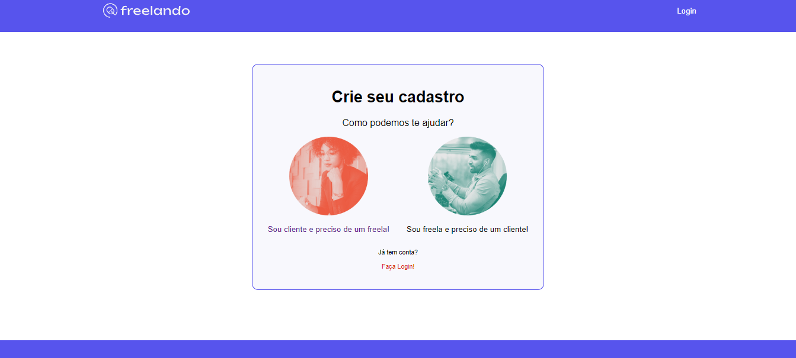

# Projeto Freelando

Projeto desenvolvido durante os cursos de React: Desenvolvendo componente customizados e acessíveis com Emotion,
Arquitetando soluções de roteamento e gestão de estado com React Router e ContextAPI e Migrando para o Vite e
implementando autenticação baseada em Token.

# Principais tecnologias utilizadas no projeto
* React
* Vite
* NodeJs
* ContextAPI
* React-Router-DOM
* Axios
* Emotion
* React-Grid-System

# Imagens do projeto

Pagina inicial

Pagina de cadastro

Continuação de cadastro

Continuação de cadastro

Pagina de finalização do cadastro

Pagina de login

Pagina de Perfil
